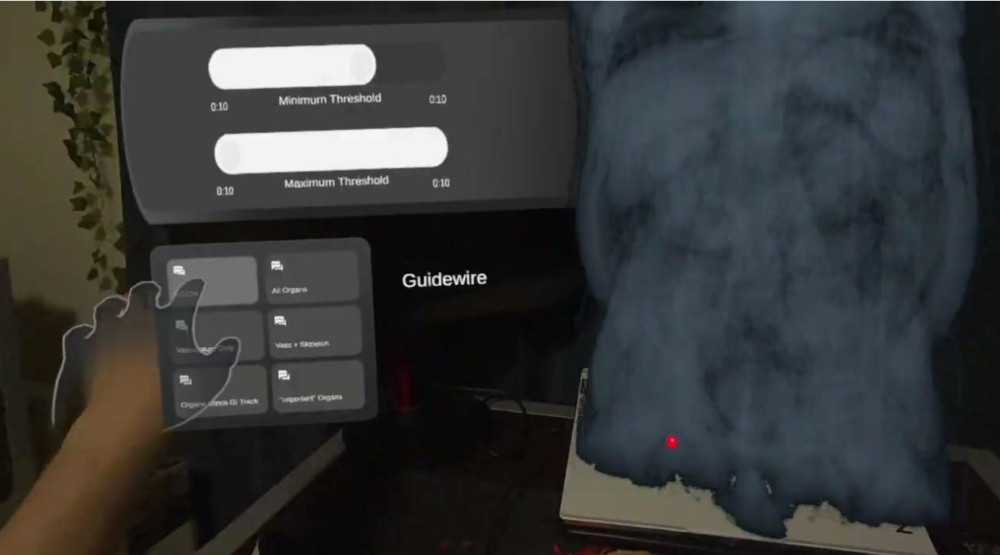
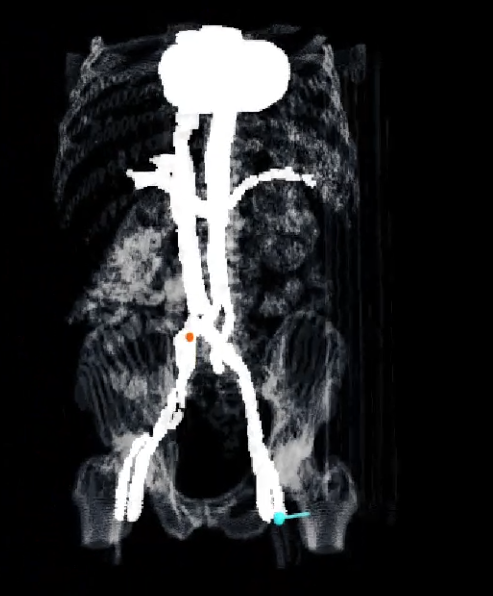
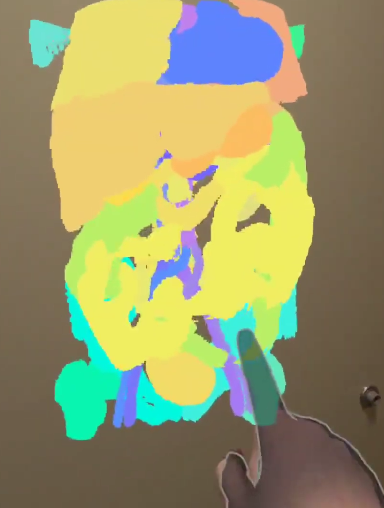
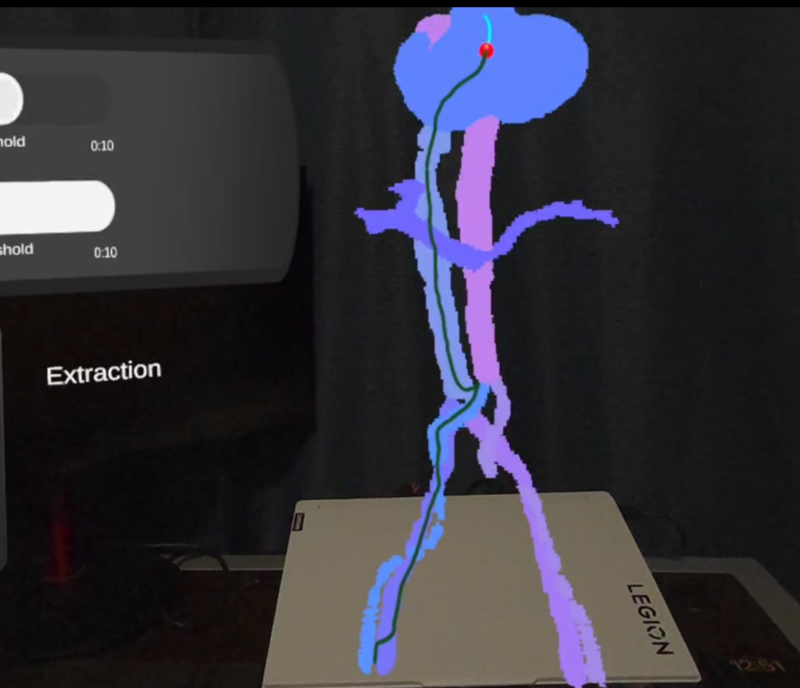
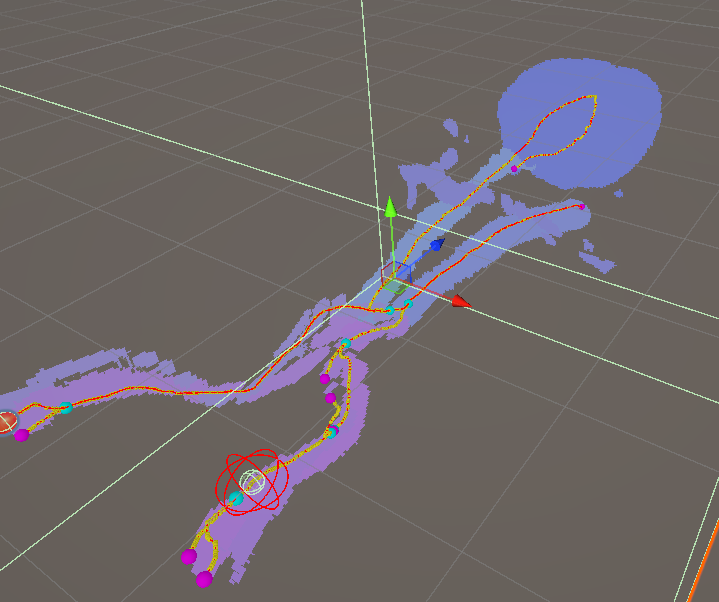

# Mixed Reality Thrombectomy Simulation

A Mixed Reality simulation of mechanical thrombectomy running on Meta Quest 3. 
Renders real patient CT-A data holographically using a custom HLSL raymarching 
shader, and simulates guidewire/catheter navigation through real vascular geometry 
extracted from the same scan.

Built for CSCI 5629 at the University of Minnesota.

**Team:** Alex Berg, Ezra Shukurov, Margad-Erdene Tegshbayar

---

## Demo

📹 [Watch the full walkthrough demo](media/Demo_Walkthrough.mp4)

---

## What It Does

- Renders a full CT-A scan in 3D using a custom raymarching shader with AABB optimization
- 6 render modes: raw DICOM, full organ segmentation, vasculature, and more
- Graph-based guidewire navigation constrained to real VMTK centerlines
- Fork puzzle mechanic at vessel bifurcations — twist to align, push to commit
- Fluoroscopy mode (hold A) with radiation exposure tracking
- Two-phase catheter simulation: guidewire navigation → catheter advance → stent deploy → extraction
- 8-event haptic feedback system throughout the procedure
- Results screen showing total time, radiation exposure, and extraction safety score

---

## Screenshots

| Fluoroscopy Mode | Organ Segmentation |
|---|---|
|  |  |

| Catheter Navigation | Vascular Graph |
|---|---|
|  |  |

---

## Tech Stack

- Unity 6000.3.6f1
- Meta Quest 3 / OpenXR
- Meta XR SDK 85.0.0
- Custom HLSL raymarching shader
- VMTK + 3D Slicer for centerline extraction
- TotalSegmentator for anatomical segmentation

---

## Setup

1. Clone or download the repo
2. Open in Unity Hub — select **Unity 6000.3.6f1**
3. Let Unity regenerate the Library folder on first open (takes a few minutes)
4. Install Meta XR SDK 85.0.0 via Package Manager if prompted
5. Add the following to `Assets/StreamingAssets/`:
   - `centerlines_vmtk.json` — VMTK centerline export from 3D Slicer
   - DICOM volume data — CT-A scan (not included due to NIH data use agreement)

DICOM data: [NIH Visible Human Project](https://datadiscovery.nlm.nih.gov/Diagnostic-Imaging/Visible-Human-Project/ux2j-9i9a/about_data)

Without these files the project will load but the volume and simulation will not function.

---

## Key Scripts

| Script | Description |
|---|---|
| `CenterlineLoader.cs` | Parses VMTK centerlines into a directed vascular graph |
| `GuidewireSimulator.cs` | Graph-based navigation, fork puzzle mechanic |
| `CatheterSimulator.cs` | Phase 2 catheter advance and extraction |
| `SimulationManager.cs` | Phase state machine |
| `HapticManager.cs` | Centralized haptic feedback |
| `FluoroController.cs` | Fluoroscopy mode and radiation timer |
| `ClotTarget.cs` | Clot placement and detection |
| `DicomVolumeLoader.cs` | DICOM volume loading and shader control |

---

## Documents

- 📄 [Final Report](media/MR_Thrombectomy_Final_Report.pdf)
- 📊 [Presentation](media/Presentation.pdf)

---

## Hardware

Meta Quest 3 required for the full experience. Can be previewed in the Unity Editor via Oculus Link.
